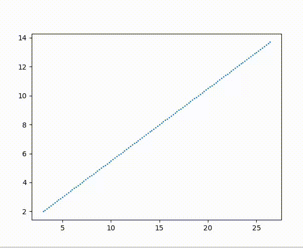
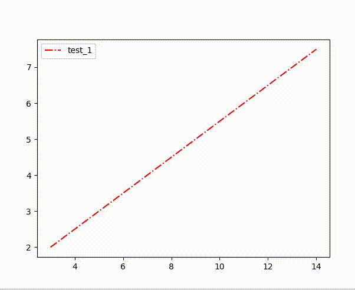
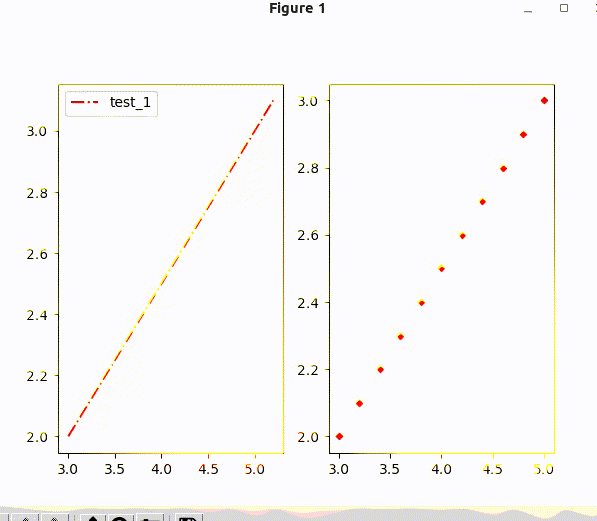

# realtime_plotter_based_matplotlibcpp
```
realtime plotter based matplotlib-cpp
only head file
```

# dependence
```
 python2.7 or python3.6
 matplotlib
 numpy
```

# install 
```
sudo apt-get install python-matplotlib python-numpy python2.7-dev
```

# usage
```cmake
find_package(PythonLibs 3.6 REQUIRED)

use your python version
```

```c++
 plotter_ptr->get_realtime_plotter<a>(b)->plot<c, d>(x, y, key_words, 3.0);

a: 每一幅图的id
b: 是否使用子图，默认为false，根据a画在再不同的图中
c: 画图的类型，线(LINE)、散点(SCATTER)、带标题的线(NAMED_LINE)、两组数据在同一幅图中更新(UPDATE)
d: 如果类型时UPDATE,需根据不同组数据的id分配id;
```

# example
1.scatter
```c++
plotter_ptr->get_realtime_plotter<1>()->plot<RealTimePlot::TYPE::SCATTER>(x, y, "test_1", "r-.");
```


2.named_line
```c++
plotter_ptr->get_realtime_plotter<1>()->plot<RealTimePlot::TYPE::NAMED_LINE>(x, y, "test_1", "r-.");
```


3.update
```c++
plotter_ptr->set_axis({0,100}, {-10, 10});

plotter_ptr->get_realtime_plotter<1>()->plot<RealTimePlot::TYPE::UPDATE>(x, y, "test_1", "r-.");

std::map<std::string, std::string> key_words;
key_words.emplace("color", "red");
key_words.emplace("marker", "D");
plotter_ptr->get_realtime_plotter<1>()->plot<RealTimePlot::TYPE::UPDATE, 2>(x, y, key_words, 10.0);
```
4.subplot
```c++
plotter_ptr->set_subplot_layout({1,2});

plotter_ptr->get_realtime_plotter<1>(true)->plot<RealTimePlot::TYPE::NAMED_LINE>(x, y, "test_1", "r-.");

std::map<std::string, std::string> key_words;
key_words.emplace("color", "red");
key_words.emplace("marker", "D");
plotter_ptr->get_realtime_plotter<2>(true)->plot<RealTimePlot::TYPE::SCATTER>(x, y, key_words, 10.0);
```



